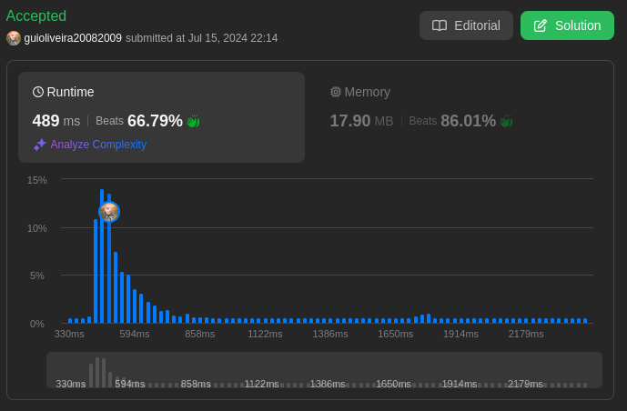
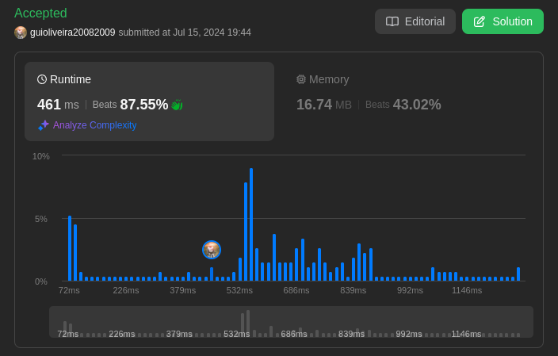

# LeetCode Problems

**Número da Lista**: 17  
**Conteúdo da Disciplina**: Grafos 2 

## Alunos
|Matrícula | Aluno |
| -- | -- |
| 20/0027158  |  Rodrigo Edmar Wright Dos Santos |
| 18/0113496  |  Guilherme de Oliveira Mendes |

## Sobre 
Neste projeto, será abordado alguns problemas disponíveis na plataforma [LeetCode](https://leetcode.com/) sobre grafos. Sendo que os problemas apresentados serão resolvidos utilizando conceitos apredidos em sala de aula.

## Screenshots
[Difícil: 1489 Find Critical and Pseudo-Critical Edges in Minimum Spanning Tree](https://leetcode.com/problems/find-critical-and-pseudo-critical-edges-in-minimum-spanning-tree/description/) 

[Difícil: ]() 

[Média: 1631 Path With Minimum Effort](https://leetcode.com/problems/path-with-minimum-effort/description/) 

[Média: ]() 

## Instalação 
**Linguagem**: C++ e Python3    
**Framework**: Não 
**Pré-requisito**: compilador de C++ e Compilador de Python3.

## Link da Apresentação
[Apresentação PA 17 - LeetCode Problems - Grafos 2]() 

