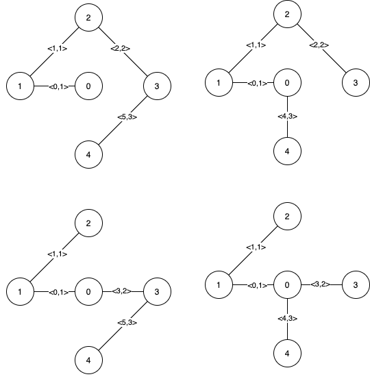

# 1631. Path With Minimum Effort

Problema: [Path With Minimum Effort](https://leetcode.com/problems/path-with-minimum-effort/description/)

**Descrição:** <br>
You are a hiker preparing for an upcoming hike. You are given heights, a 2D array of size rows x columns, where heights (row) (col) represents the height of cell **row** **col**. You are situated in the top-left cell, (0, 0), and you hope to travel to the bottom-right cell, (rows-1, columns-1) (i.e., 0-indexed). You can move up, down, left, or right, and you wish to find a route that requires the minimum effort.

A route's effort is the maximum absolute difference in heights between two consecutive cells of the route.

Return the minimum effort required to travel from the top-left cell to the bottom-right cell.


**Example 1:**<br>
<br>
**Input**: heights = [[1,2,2],[3,8,2],[5,3,5]]<br>
**Output**: 2<br>
**Explanation**: The route of [1,3,5,3,5] has a maximum absolute difference of 2 in consecutive cells.<br>
This is better than the route of [1,2,2,2,5], where the maximum absolute difference is 3.<br>


## Solução

Como no final o objetivo deste problema é encontrar o menor caminho e também sabemos que a posição inicial e final é a mesma não importanto o tamanho do "quadro" sendo estes o canto superior esquerdo e o casnto inferior direito, para este caso pode-se utilizar o algoritmo de Dijkstra para a solução. 
<br>**Exemplo:**

```Python
class Solution:
    DIR = [0, 1, 0, -1, 0]
    
    def minimumEffortPath(self, heights):
        m, n = len(heights), len(heights[0])
        dist = [[sys.maxsize] * n for _ in range(m)]
        
        minHeap = []
        heapq.heappush(minHeap, (0, 0, 0))  # (distância, linha, coluna)
        dist[0][0] = 0
```

Primiro é criado uma lista **DIR** para facilitar o cálculo dos movimentos para os vizinhos (cima, direita, baixo, esquerda). Cada par consecutivo de elementos na lista representa uma direção como DIR[0], DIR[1] para mover para a direita.<br>
Após a função **minimumEffortPath** ser chamada uma matriz 2D onde **dist[i][j]** armazena o menor esforço necessário para alcançar a célula **(i, j)**. Inicialmente, todas as distâncias são definidas para "infinito" (sys.maxsize).<br>
ele também cria uma fila de prioridade que inicialmente contém o ponto de partida (0, 0, 0) indicando (distância, linha, coluna). A distância até o ponto inicial é 0.

**Algoritmo Principal:**

```Python
while minHeap:
    d, r, c = heapq.heappop(minHeap)
    if d > dist[r][c]:
        continue  
    if r == m - 1 and c == n - 1:
        return d  
    for i in range(4):
        nr, nc = r + self.DIR[i], c + self.DIR[i + 1]
        if 0 <= nr < m and 0 <= nc < n:
            novoDist = max(d, abs(heights[nr][nc] - heights[r][c]))
            if dist[nr][nc] > novoDist:
                dist[nr][nc] = novoDist
                heapq.heappush(minHeap, (dist[nr][nc], nr, nc))
```
Após isso ele continua rodando a fila até que não hajá elementos na fila de prioridade,retornando o elemento com menor distância no **heapq.heappop(minHeap)** que vai ser processado<br>

Para verificar a consistência ele verifica se **d** for maior que **dist[r][c]**, significa que o nó já foi processado com uma menor distância, portanto ele continua para o próximo nó.<br>
Se **(r, c)** for o canto inferior direito da matriz ele retorna o **d** como o menor esforço necessário para chegar lá.

Para cada uma das quatro direções, ele calcula a nova posição **(nr, nc)** e verifica se a nova posição está dentro dos limites da matriz.
depois disso é calculado o **newDist**, que é o maior esforço necessário para se mover de **(r, c)** para **(nr, nc)**.
Se **newDist** for menor que a distância registrada **dist[nr][nc]**, ele atualiza **dist[nr][nc]** e adiciona **(newDist, nr, nc)** à fila de prioridade.


**Submissão:**<br>


# Problema Médio 2

Problema: []()

**Descrição:** <br>


**Example 1:**


**Example 2:**


## Solução


**Exemplo:**


**Submissão:**<br>


# 1489. Find Critical and Pseudo-Critical Edges in Minimum Spanning Tree

Problema: [Find Critical and Pseudo-Critical Edges in Minimum Spanning Tree](https://leetcode.com/problems/find-critical-and-pseudo-critical-edges-in-minimum-spanning-tree/description/)

**Descrição:**

Given a weighted undirected connected graph with n vertices numbered from **0** to **n - 1**, and an array edges where **edges[i] = [ai, bi, weighti]** represents a bidirectional and weighted edge between nodes ai and bi. A minimum spanning tree (MST) is a subset of the graph's edges that connects all vertices without cycles and with the minimum possible total edge weight.

Find all the critical and pseudo-critical edges in the given graph's minimum spanning tree (MST). An MST edge whose deletion from the graph would cause the MST weight to increase is called a critical edge. On the other hand, a pseudo-critical edge is that which can appear in some MSTs but not all.

Note that you can return the indices of the edges in any order.

**Example 1:**


**Input:** n = 5, edges = [[0,1,1],[1,2,1],[2,3,2],[0,3,2],[0,4,3],[3,4,3],[1,4,6]]<br>
**Output:** [[0,1],[2,3,4,5]]<br>
**Explanation:** The figure above describes the graph.<br>
The following figure shows all the possible MSTs:<br>


## Solução

Para resolver este problema,foi implementado uma solução usando a estrutura de dados Union-Find e o algoritmo de Kruskal. A lógica envolve calcular o MST original, verificar se a exclusão de uma aresta específica aumenta o peso do MST (tornando-a crítica) e verificar se a inclusão de uma aresta específica não altera o peso do MST (tornando-a pseudo-crítica).<br>

**UnionFind** 
```Python
def find(self, v1):
    while v1 != self.par[v1]:
        self.par[v1] = self.par[self.par[v1]]
        v1 = self.par[v1]
    return v1
```

Nesse caso primeiro a UnionFind é inicializada e primeiro roda a parte **Find** que encontra o representante (ou raiz) da componente à qual o nó **v1** pertence, é utilizado a técnica de compressão de caminho para tornar futuras operações find mais eficientes, ajustando o pai de cada nó encontrado no caminho para a raiz diretamente.

```Python
def union(self, v1, v2):
    p1, p2 = self.find(v1), self.find(v2)
    if p1 == p2:
        return False
    if self.rank[p1] > self.rank[p2]:
        self.par[p2] = p1
        self.rank[p1] += self.rank[p2]
    else:
        self.par[p1] = p2
        self.rank[p2] += self.rank[p1]
    return True
```
O método **Union** une as componentes que contêm os nós **v1** e **v2**, utilizando as raízes das componentes (**p1** e **p2**) obtidas através do método find. Se **p1** e **p2** já são iguais, os nós estão no mesmo componente, e não há necessidade de uni-los. Caso contrário, a componente com menor classificação é unida à de maior classificação, e a classificação é atualizada conforme necessário.

```Python
def union(self, v1, v2):
    p1, p2 = self.find(v1), self.find(v2)
    if p1 == p2:
        return False
    if self.rank[p1] > self.rank[p2]:
        self.par[p2] = p1
        self.rank[p1] += self.rank[p2]
    else:
        self.par[p1] = p2
        self.rank[p2] += self.rank[p1]
    return True
```
**Kruskal**

```Python
def kruskal(edges, n, banned_edge=None, include_edge=None):
    uf = unionfind(n)
    total_weight = 0
    edges_used = 0

    if include_edge:
        uf.union(include_edge[0], include_edge[1])
        total_weight += include_edge[2]
        edges_used += 1

    for v1, v2, w, i in edges:
        if i == banned_edge:
            continue
        if uf.union(v1, v2):
            total_weight += w
            edges_used += 1
        if edges_used == n - 1:
            break

    return total_weight if edges_used == n - 1 else float('inf')
```

Antes de começar o algoritmo de Kruskal para cada aresta na lista edges, o índice da aresta é adicionado para ajudar a identificar as arestas posteriormente, elas também são ordenadas pelo peso, para o algoritmo funcione.

O objetivo do algoritmo de Kruskal é encontrar a Árvore Geradora Mínima, este método tem dois parâmetros opcionais:<br>

**banned_edge**: Aresta a ser ignorada.<br>
**include_edge**: Aresta que deve ser obrigatoriamente incluída no MST.<br>

Uma nova instância de **unionfind** é crida e inicializa as variáveis de peso total (**total_weight**) e arestas usadas (**edges_used**), se uma aresta deve ser incluída (**include_edge**), ela é unida imediatamente e seu peso é adicionado ao total,após isso as arestas são modificadas, ignorando a aresta banida e incluindo as que passam no teste de união. Se todas as arestas necessárias forem usadas, retorna o peso total do MST, caso contrário, retorna infinito (**float('inf')**).

**Cálculo Final**

```Python
original_mst_weight = kruskal(edges, n)
        
crit, pseud = [], []
        
for n1, n2, e_peso, i in edges:
    # ver se é critical
    if kruskal(edges, n, banned_edge=i) > original_mst_weight:
        crit.append(i)
    # Ver é pseudo
    elif kruskal(edges, n, include_edge=[n1, n2, e_peso, i]) == original_mst_weight:
        pseud.append(i)
        
return [crit, pseud]
```
Após isso ele calcula o peso do MST original sem banir ou incluir arestas e coloca no **original_mst_weight**, e usando ele verifica se a aresta é critica (**crit**) ou pseudo crítica (**pseud**) conforme o seguinte críterio:<br>
Arestas Críticas: Uma aresta é crítica se, ao bani-la, o peso do MST aumenta.<br>
Arestas Pseudo-Críticas: Uma aresta é pseudo-crítica se, ao incluí-la, o peso do MST permanece o mesmo.

**Submissão:**


# Problema Díficil 2

Problema: []()

**Descrição:** <br>


**Example 1:**


**Example 2:**


**Example 3:**

## Solução


**Submissão:**<br>

